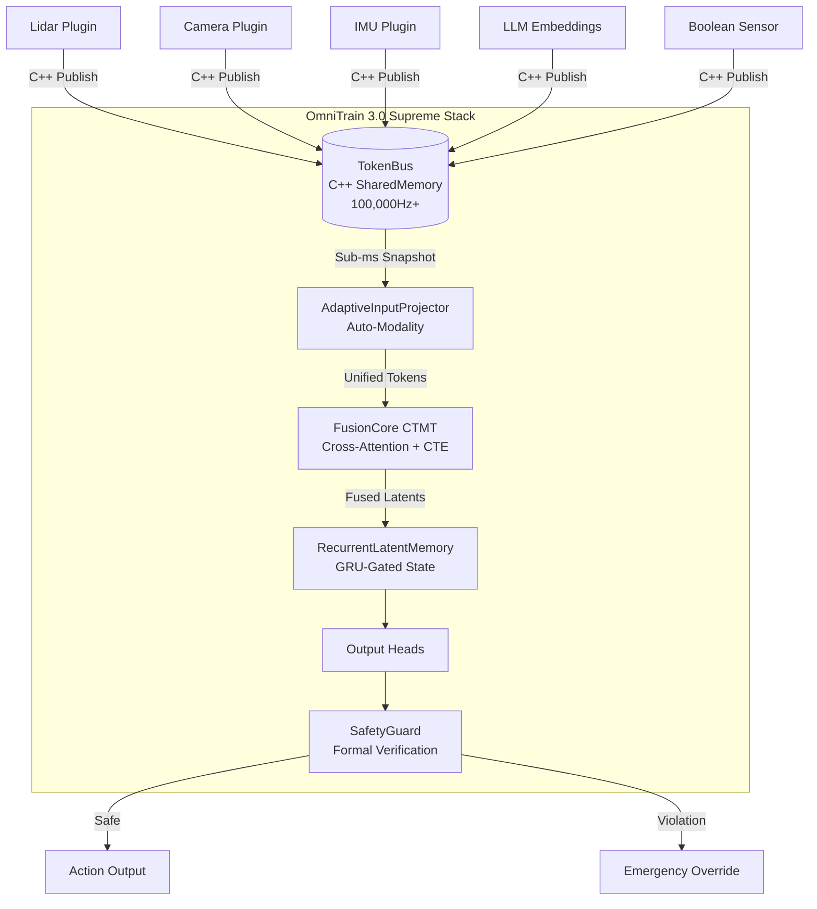

# OmniTrain — Technical Deep Dive 🔬

This document contains the detailed technical specifications, architectural insights, and advanced usage guides for the OmniTrain framework.

---

## 🏗 Full Architecture

OmniTrain uses a modular, transport-agnostic architecture designed for high-frequency sensor fusion.



---

## Key Features (Detailed)

| Feature | Description | Module |
|:--|:--|:--|
| **Auto-Modality** | Dynamically creates input projectors for any sensor dimension (256, 512, 1024...) at runtime | `fusion_core.py` |
| **Stateful Latent Memory** | GRU-gated mechanism that blends previous latent state with current inference for temporal continuity | `fusion_core.py` |
| **C++ Transport (TokenBus)** | Native Posix SharedMemory bus with atomic circular buffers for zero-copy, sub-millisecond data transfer | `token_bus.py` + `omni_bus_core.cpp` |
| **Formal Safety Verification** | Hard interval constraints that override neural network outputs to guarantee safe operation | `safety_guard.py` |
| **Structured Pruning** | L_n structured pruning that physically removes channels while respecting safety-critical layer exclusions | `pruner.py` |
| **Mixed-Precision Quantization** | INT8/FP32 mixed-precision quantization for edge deployment | `quantize_omni.py` |
| **DLA → TensorRT → CUDA → CPU** | Hardware acceleration cascade prioritizing NVIDIA DLA for near-zero power inference | `OmniEngine.cpp` |
| **FSDP Distributed Training** | Fully Sharded Data Parallel for multi-GPU training with mixed precision | `trainer.py` |
| **ROS 2 Bridge** | Native integration with ROS 2 Humble/Iron for robotics interoperability | `plugins_ros2.py` |
| **Ollama-style CLI** | Guided command-line interface for project init, monitoring, deployment, and safety audits | `cli.py` |

---

## Core Concepts

### FusionCore (Continuous-Time Multimodal Transformer)
The heart of OmniTrain. A Perceiver-style cross-attention transformer with:
- **Continuous Temporal Encoding (CTE)**: Uses sinusoidal functions on raw timestamps instead of discrete positional embeddings, allowing fusion of sensors running at different frequencies.
- **Latent Bottleneck**: Fixed-size latent array (e.g., 64 tokens) that compresses all sensor streams into a compact reasoning state.

```python
from omnitrain.fusion_core import FusionCore

core = FusionCore(
    n_latents=64,     # Number of latent tokens
    d_model=512,      # Hidden dimension
    n_heads=8,        # Attention heads
    num_layers=4,     # Transformer layers
    input_dim=512     # Default sensor dimension (auto-adjusts)
)

# Forward pass with any sensor data
sensor_data = torch.randn(1, 100, 512)  # (Batch, Tokens, Dim)
timestamps = torch.randn(1, 100, 1)      # Raw timestamps in seconds
latents = core(sensor_data, timestamps)   # (1, 64, 512)
```

### Auto-Modality
No need to pre-configure input dimensions. The `AdaptiveInputProjector` dynamically creates and caches per-modality linear projections.

### Stateful Latent Memory
Give your AI temporal continuity ("object permanence") by feeding the previous latent state back into the next inference step.

### SafetyGuard (Formal Verification)
Wraps any neural head with hard mathematical constraints that **cannot be overridden by the neural network**.

---

## Model Bundles (`.omni` format)
OmniTrain uses a standardized `.omni` bundle for shipping trained AI "brains", containing model state, architecture metadata, and versioning information.

---

## Sensor Plugins & ROS 2
OmniTrain can ingest any data stream into the C++ bus via the `ModalityPlugin` system or the native `ROS2ModalityPlugin`.

---

## Edge Deployment (C++ Engine)
The `OmniEngine` C++ runtime provides hardware-accelerated inference with automatic provider cascading (DLA → TensorRT → CUDA → CPU).

---

## Diagnostics & Testing
Run the full suite using:
```bash
python -m omnitrain.test_industrialization
```

---

## CLI Reference
- `omni init`: Generate a new project.
- `omni run <config.yaml>`: Launch training.
- `omni bus`: Monitor live sensor data.
- `omni inspect <model.omni>`: Display model metadata.
- `omni deploy <model>`: Prepare for edge deployment.
- `omni verify <model.omni>`: Run formal safety verification.

---

## Project Structure
```
OmniTrain/
├── src/
│   ├── omni_bus_core.cpp       # C++ SharedMemory transport
│   ├── omnitrain/              # Python package
│   └── cpp_engine/             # C++ inference engine
```
