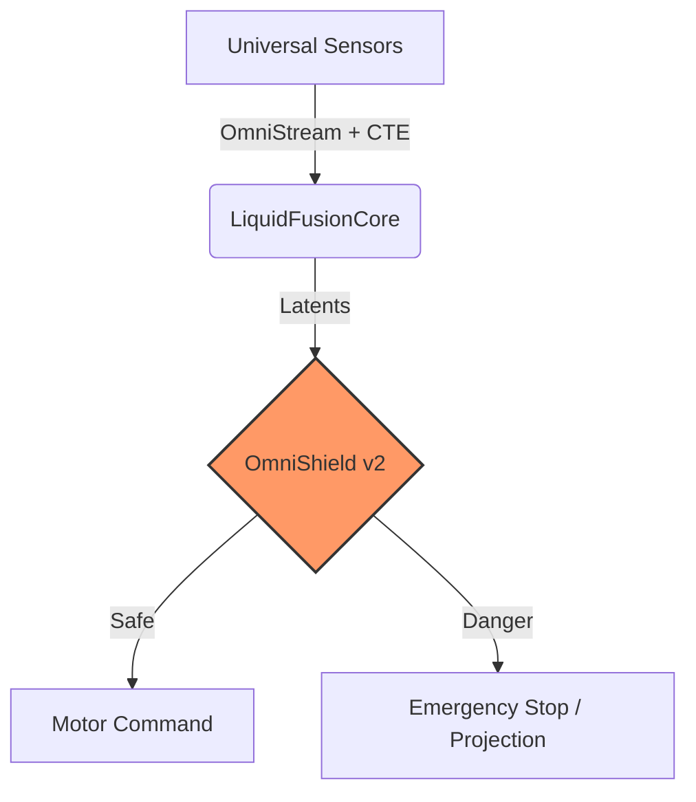

# OmniTrain 1.0.0: Liquid Intelligence
### Industrial Liquid Neural Networks & Formal Safety for Robotics

---

OmniTrain is a state-of-the-art framework for building **Liquid Neural Networks (CfC)** and **Input Convex Neural Networks (ICNN)** for industrial robotics. It focuses on sub-millisecond latency, time-continuous reasoning, and provable safety.

---

## Quick Start

### 1. Installation
```bash
git clone https://github.com/Mrmyms/Omnitrain.git
cd Omnitrain
chmod +x setup.sh
./setup.sh
```

### 2. Launch the Console
```bash
# Using the 1omni alias (if configured during setup)
1omni

# Or use the global command
omni
```

### 3. Universal Ingestion
```python
from omnitrain.omni_stream import OmniStream

stream = OmniStream(core, shield)
result = stream.send({"lidar": 1.5, "camera": "frame.jpg"})
action = result['action'] # Safe action via OmniShield
```

---

## CLI Reference

Launch the interactive dashboard with `omni` or `1omni`. Available slash commands:

| Command | Description |
| :--- | :--- |
| `/init` | Scaffold a new project interactively |
| `/status` | Monitor system health and resources |
| `/audit` | Verify environment industrialization |
| `/config` | Interactive YAML configuration editor |
| `/record` | Record TokenBus data to CSV |
| `/train` | Train a BioLiquid Neural Network (3-phase Curriculum) |
| `/run` | Launch real-time inference pipeline |
| `/bus` | Monitor live TokenBus (IPC) |
| `/inspect` | View model architecture and layers |
| `/deploy` | Prepare for edge deployment (ONNX export) |
| `/test` | Run formal safety and capability audits |
| `/clear` | Clear the terminal |
| `/exit` | Exit the framework |

---

## Core Pillars

*   **Liquid Brain (CfC)**: Closed-form Continuous-time networks for extreme OOD robustness and temporal stability.
*   **Continuous Temporal Encoding (CTE)**: Absolute arrival time projection into high-dimensional sinusoidal latent space for asynchronous sensor processing.
*   **OmniShield (ICNN)**: Formal safety verification using Input Convex Neural Networks to guarantee safe operational boundaries.
*   **Curriculum Scheduler**: Automated 3-Phase progression (Imitation, Safety, Chaos) seamlessly integrated into the training pipeline.
*   **OmniStream**: Universal sensor ingestion that auto-detects and transforms any data type (Vision, Vector, Scalar).
*   **TokenBus C++**: High-speed Shared Memory transport for sub-millisecond inter-process communication.

---

## Architecture



---

## Resources

*   **[Technical Deep Dive](docs/DETAILS.md)**: CfC cells and ICNN barriers.
*   **[Theoretical Frameworks](docs/THEORETICAL_FRAMEWORKS.md)**: Liquid Networks, ICNNs, and CTMT math.
*   **[System Capabilities](docs/CAPABILITIES.md)**: Full feature specification and Capabilities Paper.
*   **[Training Pipeline](docs/TRAINING_PIPELINE.md)**: 3-phase curriculum (Imitation, Safety, Chaos).
*   **[CLI Reference](docs/DETAILS.md#cli-reference)**: Management console usage.

---

**OmniTrain Team**
"Fuse Everything. Trust Nothing. Verify Formally."
