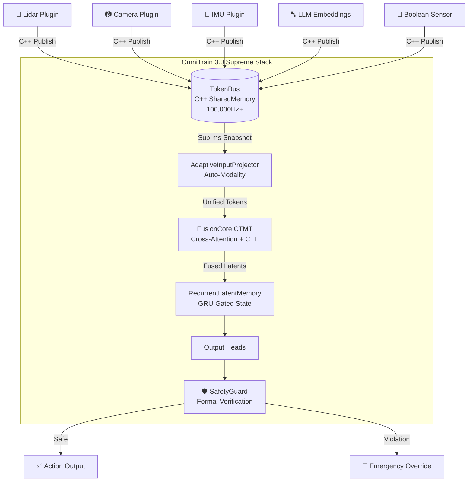

# OmniTrain 3.0 — Supreme Intelligence 🧠⚡

### Industrial Multimodal AI Framework for Robotics, Edge AI & Sensor Fusion

<p align="center">
  <strong>Train. Fuse. Deploy. Protect.</strong><br>
  A production-grade framework that fuses heterogeneous sensor streams into unified AI reasoning<br>
  at 1000Hz+ using native C++ transport, Continuous-Time Transformers, and formal safety verification.
</p>

<p align="center">
  
  
  
  
  
</p>

---

## 🌟 What is OmniTrain?

OmniTrain is a **multimodal AI framework** designed for mission-critical applications where multiple sensor streams (Lidar, Camera, IMU, GPS, Text, Boolean signals) must be fused into a single intelligent decision in **real-time**.

Unlike traditional ML frameworks that process one data type at a time, OmniTrain:

- **Fuses any sensor** into a unified latent space using Cross-Attention Transformers
- **Runs at 1000Hz+** via a native C++ Posix SharedMemory transport layer
- **Auto-discovers new modalities** at runtime (no hardcoded input dimensions)
- **Remembers across time** using GRU-gated Stateful Latent Memory
- **Guarantees safety** with formal mathematical verification that overrides neural outputs
- **Deploys to edge** with DLA/TensorRT/CUDA cascading acceleration

---

## 🏗 Architecture



---

## ✨ Key Features

| Feature | Description | Module |
|:--|:--|:--|
| **Auto-Modality** | Dynamically creates input projectors for any sensor dimension (256, 512, 1024...) at runtime | `fusion_core.py` |
| **Stateful Latent Memory** | GRU-gated mechanism that blends previous latent state with current inference for temporal continuity | `fusion_core.py` |
| **C++ Transport (TokenBus)** | Native Posix SharedMemory bus with atomic circular buffers for zero-copy, sub-millisecond data transfer | `token_bus.py` + `omni_bus_core.cpp` |
| **Formal Safety Verification** | Hard interval constraints that override neural network outputs to guarantee safe operation | `safety_guard.py` |
| **Structured Pruning** | L_n structured pruning that physically removes channels while respecting safety-critical layer exclusions | `pruner.py` |
| **Mixed-Precision Quantization** | INT8/FP32 mixed-precision quantization for edge deployment | `quantize_omni.py` |
| **DLA → TensorRT → CUDA → CPU** | Hardware acceleration cascade prioritizing NVIDIA DLA for near-zero power inference | `OmniEngine.cpp` |
| **FSDP Distributed Training** | Fully Sharded Data Parallel for multi-GPU training with mixed precision | `trainer.py` |
| **ROS 2 Bridge** | Native integration with ROS 2 Humble/Iron for robotics interoperability | `plugins_ros2.py` |
| **Ollama-style CLI** | Guided command-line interface for project init, monitoring, deployment, and safety audits | `cli.py` |

---

## 🚀 Quick Start

### 1. Installation

```bash
git clone https://github.com/mrmyms/OmniTrain.git
cd OmniTrain
pip install -e .
```

> **Note**: The C++ SharedMemory backend (`omni_bus_core`) compiles automatically during install via `pybind11`. On macOS it uses POSIX shm; on Linux it links against `librt`.

### 2. Initialize a Project

```bash
omni init
```

This generates a `config.yaml` with recommended AI backbone sizes:

```yaml
project: "My_Robot"
model:
  d_model: 512       # Thinking depth (embedding dimension)
  n_latents: 64      # Memory capacity (number of latent tokens)
  num_layers: 4      # Reasoning complexity (transformer layers)
```

### 3. Launch Training Pipeline

```bash
omni run config.yaml
```

### 4. Monitor Live Sensor Bus

```bash
omni bus
```

Watch real-time sensor pulses flowing through the C++ SharedMemory transport.

### 5. Inspect Model Architecture

```bash
omni inspect model.omni
```

### 6. Deploy to Edge

```bash
omni deploy model.omni --prune --quantize
```

Applies structured pruning + INT8 quantization and prepares the payload for the C++ inference engine.

### 7. Run Safety Audit

```bash
omni verify model.omni
```

Generates a formal safety certificate by running edge-case test scenarios through the `SafetyGuard`.

---

## 🧠 Core Concepts

### FusionCore (Continuous-Time Multimodal Transformer)

The heart of OmniTrain. A Perceiver-style cross-attention transformer with:

- **Continuous Temporal Encoding (CTE)**: Uses sinusoidal functions on raw timestamps instead of discrete positional embeddings, allowing fusion of sensors running at different frequencies.
- **Latent Bottleneck**: Fixed-size latent array (e.g., 64 tokens) that compresses all sensor streams into a compact reasoning state.

```python
from omnitrain.fusion_core import FusionCore

core = FusionCore(
    n_latents=64,     # Number of latent tokens
    d_model=512,      # Hidden dimension
    n_heads=8,        # Attention heads
    num_layers=4,     # Transformer layers
    input_dim=512     # Default sensor dimension (auto-adjusts)
)

# Forward pass with any sensor data
sensor_data = torch.randn(1, 100, 512)  # (Batch, Tokens, Dim)
timestamps = torch.randn(1, 100, 1)      # Raw timestamps in seconds
latents = core(sensor_data, timestamps)   # (1, 64, 512)
```

### Auto-Modality

No need to pre-configure input dimensions. The `AdaptiveInputProjector` dynamically creates and caches per-modality linear projections:

```python
# First time seeing GPS data (256-dim) — projector created automatically
gps_data = torch.randn(1, 10, 256)
latents = core(gps_data, timestamps, modal_id="gps")

# First time seeing camera data (1024-dim) — new projector created
cam_data = torch.randn(1, 5, 1024)
latents = core(cam_data, timestamps, modal_id="camera")
```

### Stateful Latent Memory

Give your AI temporal continuity ("object permanence"):

```python
# Step 1: First inference (no memory)
latents_t0 = core(sensor_data, timestamps, prev_latents=None)

# Step 2: Feed previous state back
latents_t1 = core(sensor_data, timestamps, prev_latents=latents_t0)
# The AI now "remembers" what it saw in the previous step
```

### Output Heads

Attach task-specific heads to the fused latent state:

```python
from omnitrain.heads import ClassificationHead, RegressionHead

# Safety classifier (Safe vs Emergency)
safety_head = ClassificationHead(num_classes=2, d_model=512)

# Motor controller (6-DOF joint positions)
motor_head = RegressionHead(output_dim=6, d_model=512)
```

### SafetyGuard (Formal Verification)

Wraps any neural head with hard mathematical constraints that **cannot be overridden by the neural network**:

```python
from omnitrain.safety_guard import SafetyGuard

guard = SafetyGuard(safety_head, emergency_class=1)

# Add physical constraints
guard.add_constraint('lidar_front', min_safe=0.10, max_safe=50.0)  # meters
guard.add_constraint('temperature', min_safe=-40.0, max_safe=85.0)  # Celsius

# Forward pass with safety override
output = guard(latents, sensor_readings={'lidar_front': 0.05})
# ⚠️ Output is FORCED to EMERGENCY regardless of neural prediction
```

---

## 📦 Model Bundles (`.omni` format)

OmniTrain uses a standardized `.omni` bundle for shipping trained AI "brains":

```python
from omnitrain.exporter import OmniExporter

# Save
OmniExporter().save(core, heads, config, "my_brain.omni")

# Load (deterministic reconstruction from architecture metadata)
core, heads, config = OmniExporter().load_as_inference("my_brain.omni")
```

The `.omni` bundle contains:
- `model_state`: Full FusionCore weights
- `heads_state`: All task head weights
- `architecture`: Complete model spec (d_model, n_latents, layers, feature flags)
- `metadata`: Training config and project info
- `version`: Bundle format version (currently `3.0-supreme`)

---

## 🔌 Creating Sensor Plugins

Ingest any data stream into the C++ bus:

```python
from omnitrain.plugins import ModalityPlugin

class LidarPlugin(ModalityPlugin):
    def read_raw_data(self):
        return get_lidar_scan()  # Your hardware SDK
    
    def encode(self, raw):
        return normalize_point_cloud(raw)  # Returns numpy array
```

### Built-in Plugins

| Plugin | Description |
|:--|:--|
| `CSVPlugin` | Ingest tabular data from CSV files |
| `ImageFolderPlugin` | Load and encode image datasets |
| `ROS2ModalityPlugin` | Subscribe to ROS 2 topics |
| `ModalityPlugin` | Base class for custom sensors |

---

## 🤖 ROS 2 Integration

Native bridge for ROS 2 Humble/Iron:

```yaml
# config.yaml
inputs:
  - id: "lidar"
    plugin: "omnitrain.plugins_ros2.ROS2ModalityPlugin"
    hz: 10
    topic_name: "/scan"
```

```bash
# Launch the bridge node
python3 -m omnitrain.ros2_bridge --topic /omni/predictions
```

---

## ⚡ Edge Deployment (C++ Engine)

The `OmniEngine` C++ runtime provides hardware-accelerated inference with automatic provider cascading:

```
Priority Order:
  0. NVIDIA DLA (Deep Learning Accelerator) — Near-zero power
  1. NVIDIA TensorRT (GPU) — Maximum throughput
  2. NVIDIA CUDA — Standard GPU
  3. CPU — Final fallback
```

### Build the C++ Engine

```bash
cd src/cpp_engine
mkdir build && cd build
cmake .. -DCMAKE_BUILD_TYPE=Release
make -j$(nproc)
```

### Run Inference

```bash
./omni_engine --model model.onnx
```

---

## 🔬 Diagnostics & Testing

### Run the Full Test Suite

```bash
python -m omnitrain.test_industrialization
```

Runs 21 tests covering: tensor-first forward, metadata loading, auto-modality, stateful latents, safety guard, and language unification.

### Run the Text-AI Diagnostic

Train a text classifier from scratch to verify the entire pipeline:

```bash
# Quick test (15 epochs)
python -m omnitrain.diagnose_text_ai

# Full convergence test (100 epochs)
python -m omnitrain.diagnose_text_ai --epochs 100

# Stress test (1000 epochs)
python -m omnitrain.diagnose_text_ai --epochs 1000
```

### Health Check

```bash
python -m omnitrain.health_check
```

---

## 🛠 CLI Reference

| Command | Description |
|:--|:--|
| `omni init` | Generate a new project with guided configuration |
| `omni run <config.yaml>` | Launch the full training pipeline |
| `omni bus` | Monitor live sensor data on the C++ SharedMemory bus |
| `omni inspect <model.omni>` | Display model architecture, parameter count, and metadata |
| `omni deploy <model> [--prune] [--quantize]` | Prepare model for edge deployment |
| `omni verify <model.omni>` | Run formal safety verification and generate certificate |

---

## 📁 Project Structure

```
OmniTrain/
├── pyproject.toml              # Package configuration
├── setup.py                    # C++ extension build (pybind11)
├── requirements.txt            # Python dependencies
├── LICENSE                     # MIT License
├── README.md                   # This file
│
├── src/
│   ├── omni_bus_core.cpp       # C++ SharedMemory transport (pybind11)
│   │
│   ├── omnitrain/              # Python package
│   │   ├── __init__.py         # Package exports
│   │   ├── cli.py              # Ollama-style CLI (omni command)
│   │   ├── fusion_core.py      # FusionCore CTMT + AutoModality + StatefulMemory
│   │   ├── heads.py            # Classification & Regression output heads
│   │   ├── token_bus.py        # TokenBus (Python ↔ C++ SharedMemory bridge)
│   │   ├── trainer.py          # OmniTrainer with FSDP support
│   │   ├── safety_guard.py     # Formal safety verification module
│   │   ├── exporter.py         # .omni bundle save/load with architecture metadata
│   │   ├── onnx_exporter.py    # ONNX export for C++ engine
│   │   ├── pruner.py           # Structured pruning (L_n channel removal)
│   │   ├── quantize_omni.py    # INT8/FP32 mixed-precision quantization
│   │   ├── plugins.py          # Base modality plugin system
│   │   ├── plugins_real.py     # Hardware sensor plugins (CSV, Image)
│   │   ├── plugins_ros2.py     # ROS 2 topic subscription plugin
│   │   ├── ros2_bridge.py      # ROS 2 ↔ OmniTrain bridge node
│   │   ├── launcher.py         # Pipeline orchestrator
│   │   ├── monitor.py          # Live bus monitoring
│   │   └── health_check.py     # System health diagnostics
│   │
│   └── cpp_engine/             # C++ inference engine
│       ├── CMakeLists.txt      # CMake build configuration
│       ├── include/
│       │   └── OmniEngine.hpp  # Engine header
│       └── src/
│           └── OmniEngine.cpp  # DLA/TRT/CUDA/CPU provider cascade
```

---

## 📋 Requirements

- **Python** >= 3.9
- **PyTorch** >= 2.0
- **NumPy** >= 1.21
- **Rich** (terminal UI)
- **PyYAML** (configuration)
- **pybind11** >= 2.6 (C++ extension build)
- **ONNX** + **ONNXRuntime** (optional, for C++ engine export)

### Optional (Edge Deployment)
- NVIDIA CUDA Toolkit
- NVIDIA TensorRT
- NVIDIA Jetson Orin (for DLA acceleration)

---

## 🔒 Safety Philosophy

OmniTrain follows a **"Neural + Formal" safety architecture**:

1. **Neural Layer**: The FusionCore + SafetyHead learns statistical patterns from data
2. **Formal Layer**: The `SafetyGuard` enforces hard mathematical constraints that **cannot be violated by the neural network**
3. **Exclusion Layer**: Safety-critical layers are excluded from pruning and quantization

This means even if the AI is wrong, the robot will still behave safely.

---

## 📄 License

MIT License — Built for industrial excellence.

Copyright (c) 2026 OmniTrain Contributors.

---

## 🤝 Contributing

1. Fork the repository
2. Create your feature branch (`git checkout -b feature/amazing-feature`)
3. Run the test suite (`python -m omnitrain.test_industrialization`)
4. Commit your changes (`git commit -m 'Add amazing feature'`)
5. Push to the branch (`git push origin feature/amazing-feature`)
6. Open a Pull Request

---

<p align="center">
  Built with 🧠 by the OmniTrain Team<br>
  <em>"Fuse Everything. Trust Nothing. Verify Formally."</em>
</p>
