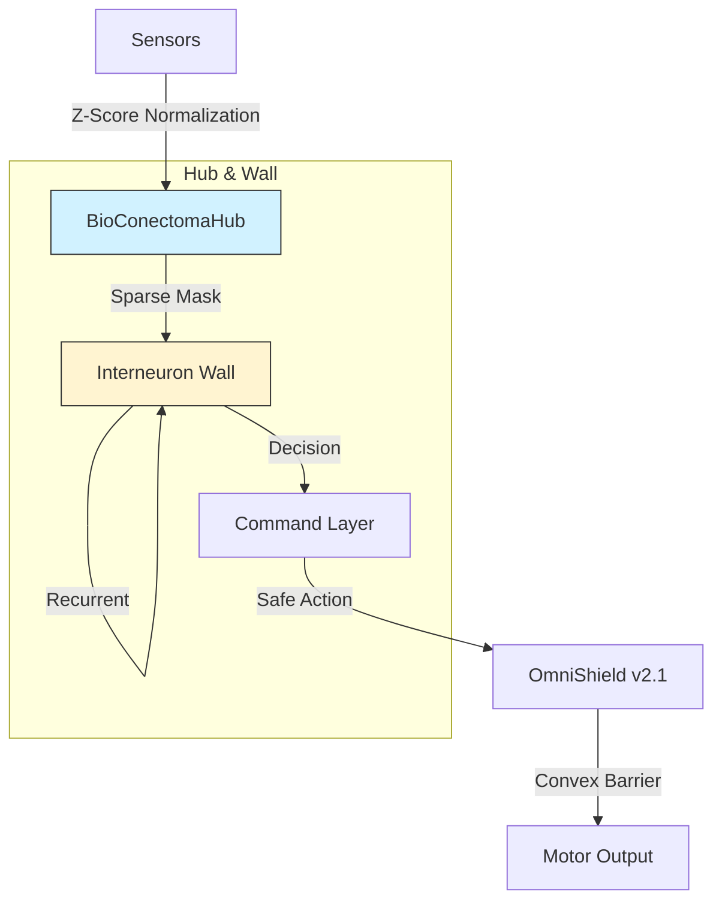

# OmniTrain v2.1.0: Conectoma 
### Bio-Inspired Sparse Neural Circuits & Formal Safety for Robotics

---

OmniTrain is a production-grade framework for building **Bio-Inspired Conectomas (Hub & Wall architecture)**. It utilizes Closed-form Continuous-time (CfC) networks and Input Convex Neural Networks (ICNN) to provide sub-millisecond, provably safe robotic control on edge hardware (Jetson/Qualcomm).

---

## What's New in v2.1 (Update)

- **Training-Serving Parity**: Automatic capture and application of Z-Score normalization statistics. No more data degradation in deployment.
- **Lagrangian Stability**: Stabilized primal-dual safety controller using per-sequence dual updates.
- **Unified Fusion**: Optimized multi-sensor ingestion in `OmniStream` to prevent neural double-evolution.
- **Kernel Robustness**: Enhanced CLI with kernel-level exception handling for 24/7 mission-critical operation.
- **Hardware Failsafes**: Improved Tier 1 monitoring with worst-case coverage across all sensor dimensions.
- **Stabilization**: Passed the Integrity 5-Problem Health Audit (v2.1) ensuring zero-leak SHM and RK4 dynamics parity.

---

## Quick Start

### 1. Installation
```bash
git clone https://github.com/Mrmyms/Omnitrain.git
cd Omnitrain
chmod +x setup.sh
./setup.sh
```

### 1.1 Windows Installation
```powershell
git clone https://github.com/Mrmyms/Omnitrain.git
cd Omnitrain
python -m venv .venv
.venv\Scripts\activate
pip install -r requirements.txt
pip install -e .
python tests\test_integrity.py
```

### 2. Launch the Console
```bash
# Enter the interactive Dashboard
omni
```

### 3. Initialize & Train
```bash
# Inside the omni console:
> /init
> /train
```

---

## CLI Reference (Slash Commands)

| Command | Description |
| :--- | :--- |
| `/init` | Scaffold a new project environment |
| `/record` | Record live TokenBus telemetry to CSV |
| `/train` | Stateful Lagrangian Training (3-Phase Curriculum) |
| `/diagnose` | Run a Saliency Audit on sensory paths |
| `/deploy` | Export to unified ONNX (Stripped Hooks) |
| `/bus` | Monitor live multimodal IPC stream |
| `/status` | Deep system health & SHM audit |
| `/prune` | Synaptic Consolidation (Sparse Pruning) |
| `/audit` | System Integrity & Health Audit |
| `/exit` | Exit the framework |

---

## Architecture: The Conectoma v2.1



---

## Resources

*   **[Technical Deep Dive](docs/DETAILS.md)**: CfC cells and ICNN barriers.
*   **[Theoretical Frameworks](docs/THEORETICAL_FRAMEWORKS.md)**: Liquid Networks, ICNNs, and CTMT math.
*   **[Conectoma Spec](docs/CONECTOMA_SPEC.md)**: Official architecture specification.
*   **[Training Pipeline](docs/TRAINING_PIPELINE.md)**: 3-phase curriculum (Imitation, Safety, Noise).

---

**OmniTrain Team**
"Fuse Everything. Trust Nothing. Verify Formally."
