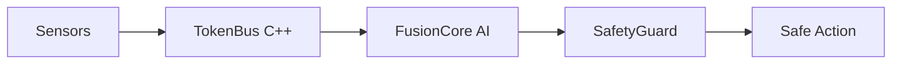

# OmniTrain

### Multimodal AI Framework for Robotics, Edge AI & Sensor Fusion

[](https://github.com/mrmyms/OmniTrain)
[](https://python.org)
[](https://pytorch.org)
[](LICENSE)

**OmniTrain** is a high-performance framework designed to fuse heterogeneous sensor streams (Lidar, Camera, IMU, etc.) into unified AI reasoning in real-time. Built for robotics and mission-critical edge deployments.

---

## Quick Start

### 1. Install
```bash
pip install -e .
```

### 2. Initialize
```bash
omni init
```

### 3. Train
```bash
omni run config.yaml
```

---

## Why OmniTrain?

*   **Multimodal Fusion**: Seamlessly combine any sensor data into a unified latent space using Cross-Attention Transformers.
*   **Real-Time Performance**: Runs at 1000Hz+ via a native C++ SharedMemory transport layer (TokenBus).
*   **Formal Safety**: Hard mathematical constraints that override neural outputs to guarantee safe operations in any environment.
*   **Edge Ready**: Native support for NVIDIA DLA, TensorRT, and CUDA with automated pruning and quantization.

---

## High-Level Architecture



---

## Documentation & Resources

*   **[Technical Deep Dive](DETAILS.md)**: Detailed architecture, code examples, and CLI reference.
*   **[Core Concepts](DETAILS.md#core-concepts)**: FusionCore, Auto-Modality, and Stateful Memory.
*   **[Deployment Guide](DETAILS.md#edge-deployment-c-engine)**: Pruning, Quantization, and C++ Engine.

---

<p align="center">
  Built by the OmniTrain Team (MRMYMS)<br>
  <em>"ONE brain, ALL you can process"</em>
</p>
