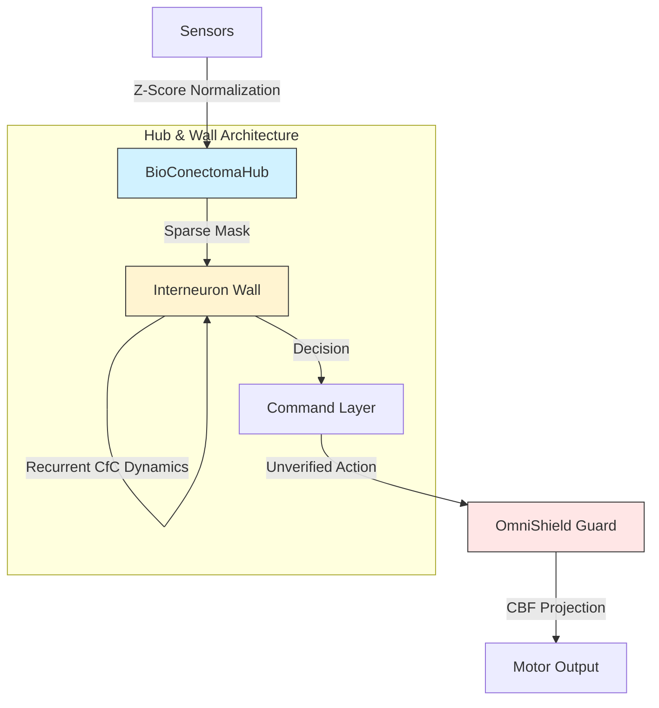

# OmniTrain: Bio-Inspired Sparse Neural Circuits & Formal Safety for Robotics
**Version 2.1.0 | Conectoma Architecture**

[](https://opensource.org/licenses/MIT)
[](https://www.python.org/downloads/)
[](https://isocpp.org/)
[]()
[]()

> [!NOTE]
> **Research Status:** OmniTrain is an active research framework designed for high-frequency, safety-critical robotics. It bridges the gap between biological neural efficiency and formal mathematical safety constraints.

---

## Abstract

OmniTrain is a production-grade framework for building **Bio-Inspired Conectomas (Hub & Wall architectures)**. It leverages Closed-form Continuous-time (CfC) networks and Input Convex Neural Networks (ICNNs) to provide sub-millisecond, provably safe robotic control on edge hardware (Jetson, ESP32, Snapdragon). By moving away from dense, synchronous Transformer/LSTM topologies, OmniTrain offers a sparse, asynchronous, and temporally resilient paradigm suitable for out-of-distribution (OOD) physical environments.

---

## Key Innovations in v2.1

- **Continuous-Time Temporal Resilience:** ODE solvers naturally interpolate missing sensor frames and irregular intervals (jitter), outperforming discrete-time architectures like LSTMs.
- **Asynchronous Sensor Fusion (ZOH):** Zero-Order Hold (ZOH) buffers in the `OmniStream` layer natively fuse disparate sensor frequencies (e.g., 20Hz LiDAR and 1Hz Vision) without causing neural "double-evolution" or artificial latency.
- **Formal Safety Guarantees (OmniShield):** An integrated Control Barrier Function (CBF) enforced by an ICNN ensures that exploratory or out-of-distribution neural actions are strictly projected back into a mathematically proven safe set in $O(1)$ time.
- **Zero-Copy Edge Deployment:** Compiles trained PyTorch parameters into the `.omnibit` V3 format, a highly structured binary payload optimized for zero-copy execution on deeply embedded microcontrollers (e.g., ESP32, RP2040) yielding sub-3ms latencies.

---

## Quick Start

### 1. Installation

Install OmniTrain via PyPI:
```bash
pip install omnitrain
```

Or install from source for development:
```bash
git clone https://github.com/Mrmyms/Omnitrain.git
cd Omnitrain
pip install -r requirements.txt
pip install -e .
```

### 2. Scaffold a New Project
Initializes project directories, configurations, and data ingestion pipelines.
```python
from omnitrain import ProjectManager

ProjectManager.init_project()
```

### 3. Programmatic Training Curriculum
```python
from omnitrain import LiquidTrainer

# Instantiate the trainer and fit both behavioral and safety policies
trainer = LiquidTrainer("config.yaml")
metrics = trainer.fit("training_data.csv", epochs=30)
```

### 4. Edge Deployment Compilation
```python
from omnitrain import EdgeDeployer, ESP32Exporter

# Export to Microcontrollers (ESP32) Zero-Copy Binary
exporter = ESP32Exporter(output_dir="esp32_firmware/data")
exporter.export(model, input_dim=64, d_model=128, output_dim=4, filename="model.omnibit")
```

### 5. Multi-process Sensor Runner
```python
from omnitrain import AgentRunner

# Instantiate the real-time TokenBus circular buffer and sensor aligners
runner = AgentRunner("config.yaml")
runner.start()

# Monitor live circular buffer stream telemetry
runner.run_telemetry(duration=10.0)
runner.stop()
```

---

## Architecture: The Conectoma Topology


```mermaid
graph TD
    S1[Sensors] -->|Z-Score Normalization| H[BioConectomaHub]
    subgraph "Hub & Wall Architecture"
        H -->|Sparse Mask| W[Interneuron Wall]
        W -->|Recurrent CfC Dynamics| W
        W -->|Decision| C[Command Layer]
    end
    C -->|Unverified Action| SG[OmniShield Guard]
    SG -->|CBF Projection| M[Motor Output]
    
    style H fill:#d1f2ff,stroke:#333
    style W fill:#fff4d1,stroke:#333
    style SG fill:#ffe6e6,stroke:#333
```

---

## Documentation & Resources

*   **[Technical Deep Dive & Conectoma Spec](docs/CONECTOMA_SPEC.md)**: Official architecture specification detailing CfC cells and ICNN barriers.
*   **[Theoretical Frameworks](docs/THEORETICAL_FRAMEWORKS.md)**: Mathematical foundations of Liquid Networks, ICNNs, and continuous-time dynamics.
*   **[Connectivity Guide](docs/HOW_TO_CONNECT.md)**: Integrating sensors (ROS 2, Isaac Sim, TokenBus).
*   **[LNN Research Database](docs/LIQUID_NETWORKS_DB.md)**: Annotated references spanning MIT CSAIL literature, benchmarks, and Liquid Neural Network proofs.
*   **[Training Pipeline](docs/TRAINING_PIPELINE.md)**: Phased curriculum covering Imitation, Safety, and Lagrangian Stability.
*   **[ESP32 Edge Port Guide](docs/ESP32_PORT_GUIDE.md)**: Bare-metal deployment instructions for 512KB microcontrollers.

---

**OmniTrain Research Group**  
*Fuse Everything. Trust Nothing. Verify Formally.*
