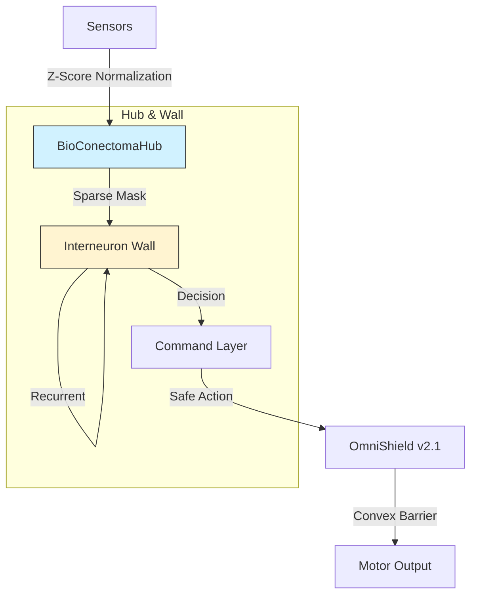

# OmniTrain v2.1.0: Conectoma 
### Bio-Inspired Sparse Neural Circuits & Formal Safety for Robotics

> [!WARNING]
> This project is currently **UNFINISHED** and in **PRE-BETA** phase. Core features and APIs are undergoing active development, testing, and security audits. Use with caution.

---

OmniTrain is a production-grade framework for building **Bio-Inspired Conectomas (Hub & Wall architecture)**. It utilizes Closed-form Continuous-time (CfC) networks and Input Convex Neural Networks (ICNN) to provide sub-millisecond, provably safe robotic control on edge hardware (Jetson/Qualcomm).

---

## What's New in v2.1 (Update)

- **Training-Serving Parity**: Automatic capture and application of Z-Score normalization statistics. No more data degradation in deployment.
- **Lagrangian Stability**: Stabilized primal-dual safety controller using per-sequence dual updates.
- **Unified Fusion**: Optimized multi-sensor ingestion in `OmniStream` to prevent neural double-evolution.
- **Kernel Robustness**: Enhanced CLI with kernel-level exception handling for 24/7 mission-critical operation.
- **Hardware Failsafes**: Improved Tier 1 monitoring with worst-case coverage across all sensor dimensions.
- **Stabilization**: Passed the Integrity 5-Problem Health Audit (v2.1) ensuring zero-leak SHM and RK4 dynamics parity.

---

## Quick Start

### 1. Installation

You can install OmniTrain directly from PyPI:
```bash
pip install omnitrain
```

Alternatively, you can install from source:

#### Linux/macOS Source Installation
```bash
git clone https://github.com/Mrmyms/Omnitrain.git
cd Omnitrain
chmod +x setup.sh
./setup.sh
```

#### Windows Source Installation
```powershell
git clone https://github.com/Mrmyms/Omnitrain.git
cd Omnitrain
python -m venv .venv
.venv\Scripts\activate
pip install -r requirements.txt
pip install -e .
```

### 2. Scaffold a New Project
```python
from omnitrain import ProjectManager

# Set up project folders, default config.yaml, and a training dataset
ProjectManager.init_project()
```

### 3. Programmatic Training Curriculum
```python
from omnitrain import LiquidTrainer

# Load trainer and fit behavioral and safety policies
trainer = LiquidTrainer("config.yaml")
metrics = trainer.fit("robot_logs.csv", epochs=5)
```

### 4. Edge Deployment Compile
```python
from omnitrain import EdgeDeployer

# Compile brain checkpoint to optimized ONNX or Qualcomm Snapdragon DLC format
deployer = EdgeDeployer("models/bot_brain.omni")
deployer.export(target="tensorrt")
```

### 5. Multi-process Sensor Runner
```python
from omnitrain import AgentRunner

# Start the real-time TokenBus circular buffer and spawn sensor modalities
runner = AgentRunner("config.yaml")
runner.start()

# Monitor live circular buffer stream telemetry for 10 seconds
runner.run_telemetry(duration=10.0)
runner.stop()
```

---

## Architecture: The Conectoma v2.1


```mermaid
graph TD
    S1[Sensors] -->|Z-Score Normalization| H[BioConectomaHub]
    subgraph "Hub & Wall"
        H -->|Sparse Mask| W[Interneuron Wall]
        W -->|Recurrent| W
        W -->|Decision| C[Command Layer]
    end
    C -->|Safe Action| SG[OmniShield v2.1]
    SG -->|Convex Barrier| M[Motor Output]
    style H fill:#d1f2ff,stroke:#333
    style W fill:#fff4d1,stroke:#333
```

---

## Resources

*   **[Technical Deep Dive & Conectoma Spec](docs/CONECTOMA_SPEC.md)**: Official architecture specification, CfC cells, and ICNN barriers.
*   **[Theoretical Frameworks](docs/THEORETICAL_FRAMEWORKS.md)**: Liquid Networks, ICNNs, and CTMT math.
*   **[Connectivity Guide](docs/HOW_TO_CONNECT.md)**: Connecting sensors (ROS 2, Isaac Sim, CSV) to TokenBus.
*   **[LNN Research Database](docs/LIQUID_NETWORKS_DB.md)**: MIT CSAIL papers, benchmarks, and LNN/CfC references.
*   **[Training Pipeline](docs/TRAINING_PIPELINE.md)**: 5-phase curriculum (Imitation, Safety, Noise, Lagrangian Stability, Pruning).

---

**OmniTrain Team**
"Fuse Everything. Trust Nothing. Verify Formally."
