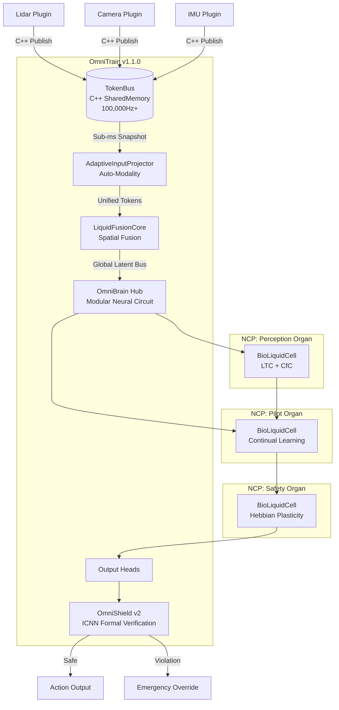

# OmniTrain — Technical Deep Dive 
**Version 1.1.0 (BioLiquid)**

This document contains the detailed technical specifications, architectural insights, and advanced usage guides for the OmniTrain framework.

---

## Full Architecture

OmniTrain uses a modular, transport-agnostic architecture designed for high-frequency sensor fusion and dynamic physical adaptation.



---

## Key Features

| Feature | Description | Module |
|:--|:--|:--|
| **Multi-Brain Hub** | Organizes neurons into specialized Neural Circuit Policies (NCPs) that communicate via a latent bus. | `fusion_core.py` |
| **BioLiquidCell (LTC + CfC)** | Fuses the closed-form continuous-time math (CfC) with the bio-physical parameter constraints (LTC) from the official MIT implementation. | `fusion_core.py` |
| **Continual Learning** | Live, on-the-fly Hebbian Plasticity (Oja's Rule) for Sim-to-Real adaptation without backpropagation. | `fusion_core.py` |
| **Auto-Modality** | Dynamically creates input projectors for any sensor dimension (256, 512, 1024...) at runtime. | `fusion_core.py` |
| **C++ Transport (TokenBus)** | Native Posix SharedMemory bus with atomic circular buffers for zero-copy, sub-millisecond data transfer. | `token_bus.py` + `omni_bus_core.cpp` |
| **Formal Safety Verification** | Input Convex Neural Networks (ICNN) that override neural network outputs to guarantee safe operation. | `safety_guard.py` |

---

## Core Concepts

### LiquidFusionCore & OmniBrain Hub
The heart of OmniTrain v1.1.0. It fuses spatial information and feeds it into a modular system of interconnected liquid brains.
- **Continuous Temporal Encoding (CTE)**: Uses sinusoidal functions on raw timestamps instead of discrete positional embeddings. *Fully implemented in v1.1.1 to map absolute arrival time to the latent space for asynchronous sensor processing.*
- **BioLiquid Dynamics**: Memory is evolved through time using biological time-constants (capacitance and leakage) bounded strictly via `softplus` projections.
- **Hebbian Plasticity**: During inference, the network rewires its synapses based on input-output correlation, adapting to mechanical wear automatically.
- **Curriculum Scheduler**: A formal 3-phase automated progression (Imitation, Safety, Chaos) seamlessly integrated into the `UniversalTrainer` for Domain Randomization and out-of-distribution resilience.

```python
import torch
from omnitrain.fusion_core import LiquidFusionCore

# Define a Multi-Brain Hub configuration
config = {
    'model': {
        'n_latents': 32,
        'd_model': 256,
        'continual_learning': True,
        'hub': {
            'perception': {'sensory': 16, 'inter': 32, 'command': 12, 'motor': 256},
            'pilot': {'sensory': 8, 'inter': 16, 'command': 8, 'motor': 256, 'inputs_from': ['perception']}
        }
    }
}

core = LiquidFusionCore(config=config)

# Forward pass with sequence (Batch, Time, Dim)
sensor_data = torch.randn(1, 10, 512) 
timestamps = torch.linspace(0.0, 1.0, 10).view(1, 10) # 10 steps of 0.1s
output = core(sensor_data, timestamps) 
```

### SafetyGuard (Formal Verification)
Wraps any neural head with hard mathematical convex constraints that **cannot be overridden by the neural network**.

---

## Model Bundles (`.omni` format)
OmniTrain uses a standardized `.omni` bundle for shipping trained AI "brains", containing model state, architecture metadata, and versioning information.

---

## Edge Deployment (C++ Engine)
The `OmniEngine` C++ runtime provides hardware-accelerated inference with automatic provider cascading (DLA → TensorRT → CUDA → CPU).

---

## Diagnostics & Testing
Run the full suite using:
```bash
python -m omnitrain.test_industrialization
```

---

## CLI Reference
Interactive Claude-style REPL commands:
- `/init`: Scaffold a new project interactively.
- `/train <config.yaml>`: Train the BioLiquid Neural Network.
- `/run <config.yaml>`: Launch real-time inference pipeline.
- `/bus`: Monitor live TokenBus sensor data.
- `/status`: Check system health and hardware availability.
- `/deploy <model>`: Prepare for edge deployment (ONNX export).
- `/test <model.omni>`: Run formal safety verification.

---

## Project Structure
```
OmniTrain/
├── src/
│   ├── omni_bus_core.cpp       # C++ SharedMemory transport
│   ├── omnitrain/              # Python package
│   └── cpp_engine/             # C++ inference engine
```
