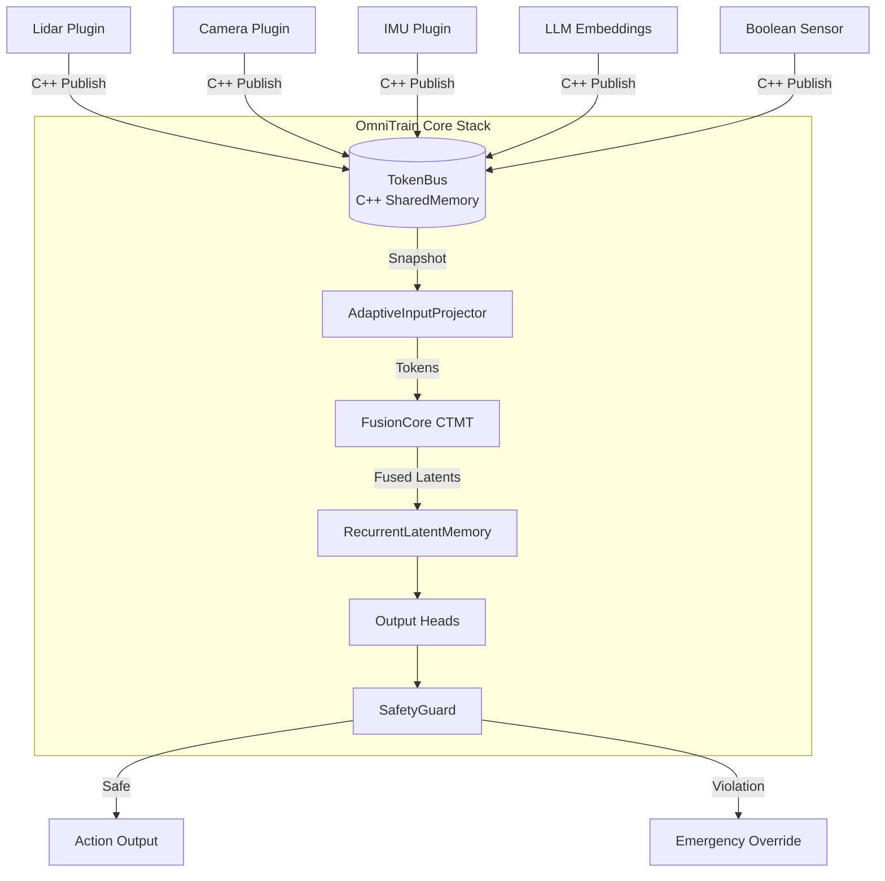

# OmniTrain — Technical Details

This document provides technical specifications, architectural insights, and advanced usage guides for the OmniTrain framework.

---

## Architecture

OmniTrain utilizes a modular, transport-agnostic architecture optimized for high-frequency sensor fusion.

---

## Core Features

| Feature | Description | Module |
|:--|:--|:--|
| **Auto-Modality** | Runtime projection for dynamic sensor dimensions. | `fusion_core.py` |
| **Stateful Memory** | GRU-gated latent persistence for temporal continuity. | `fusion_core.py` |
| **TokenBus** | Native SharedMemory bus for zero-copy data transfer. | `token_bus.py` |
| **SafetyGuard** | Formal constraint verification for safe operation. | `safety_guard.py` |
| **Pruning** | Structured L_n pruning for channel removal. | `pruner.py` |
| **Quantization** | INT8/FP32 mixed-precision optimization. | `quantize_omni.py` |
| **Hardware Support** | DLA, TensorRT, CUDA, and CPU provider cascade. | `OmniEngine.cpp` |
| **Distributed Training** | FSDP support for multi-GPU scaling. | `trainer.py` |

---

## Core Concepts

### FusionCore (Continuous-Time Multimodal Transformer)
A Perceiver-style cross-attention transformer utilizing:
- **Continuous Temporal Encoding (CTE)**: Sinusoidal functions for asynchronous sensor fusion.
- **Latent Bottleneck**: Fixed-size token array for reasoning compression.

### Auto-Modality
The `AdaptiveInputProjector` dynamically creates and caches per-modality linear projections, eliminating the need for pre-configured input dimensions.

### SafetyGuard
Wraps neural output heads with hard mathematical constraints to ensure safe operating envelopes, regardless of model prediction.

---

## Deployment (C++ Engine)

The `OmniEngine` C++ runtime provides hardware-accelerated inference with automatic provider cascading:
1.  **NVIDIA DLA** (Deep Learning Accelerator)
2.  **NVIDIA TensorRT** (GPU Optimized)
3.  **NVIDIA CUDA** (Standard GPU)
4.  **CPU** (Fallback)

---

## CLI Reference

- `omni init`: Scaffold a new project.
- `omni run <config.yaml>`: Launch training and simulation.
- `omni bus`: Monitor real-time sensor pulses.
- `omni inspect <model.omni>`: View architecture and metadata.
- `omni deploy <model>`: Prepare for edge deployment.
- `omni verify <model.omni>`: Run formal safety verification.

---

OmniTrain Team
"Fuse Everything. Trust Nothing. Verify Formally."
