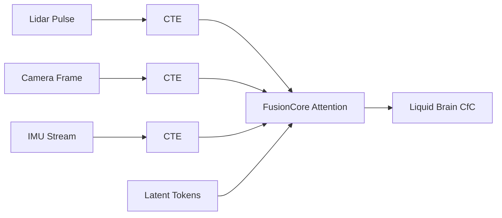

# OmniTrain: Theoretical Foundations & Architectural White Paper
**Version 1.0.0** | **Industrial Robotics & Autonomous Systems**
*Authored by the OmniTrain Research Group*

---

## Abstract
This document serves as the formal theoretical specification for the OmniTrain framework. We propose a unified architecture that bridges the gap between high-frequency stochastic sensor data and provably safe actuation. By synthesizing **Closed-form Continuous-time (CfC)** neural dynamics with **Input Convex Neural Network (ICNN)** safety barriers, OmniTrain achieves sub-millisecond latency and formal robustness in Out-Of-Distribution (OOD) environments.

---

## 1. Temporal Dynamics: Liquid Neural Networks (CfC)
The core of OmniTrain’s reasoning engine is built upon the theory of **Liquid Time-constant (LTC)** systems, specifically the **Closed-form Continuous-time (CfC)** variant.

### 1.1 The ODE Bottleneck
Traditional recurrent architectures (LSTMs, GRUs) operate on discrete time-steps, failing to capture the underlying continuous physics of robotic motion. Standard Liquid Networks solve this via Ordinary Differential Equations (ODEs), but suffer from high computational costs during numerical integration.

### 1.2 The CfC Solution
We implement the closed-form approximation of the liquid dynamics, which allows for:
- **Continuous reasoning** without numerical solvers.
- **Variable-frequency fusion:** The network state $h(t)$ is a continuous function of time.

$$y(t) = \sigma(-f(x, \theta) \cdot t) \odot g(x, \theta) + [1 - \sigma(-f(x, \theta) \cdot t)] \odot h(x, \theta)$$

Where:
- $f(x, \theta)$ represents the **Time-constant Head**, modulating the speed of information decay.
- $g(x, \theta)$ and $h(x, \theta)$ represent the **Sensory** and **Internal state** components.

---

## 2. Formal Safety: Input Convex Neural Networks (ICNN)
To ensure industrial-grade reliability, OmniTrain utilizes **OmniShield v2**, a safety layer based on the theory of **Control Barrier Functions (CBF)** learned through ICNNs.

### 2.1 Theoretical Guarantee
An ICNN ensures that the function $f(u)$ is convex with respect to the control input $u$. 
$$\forall u_1, u_2 \in \mathcal{U}, \lambda \in [0,1]: f(\lambda u_1 + (1-\lambda) u_2) \leq \lambda f(u_1) + (1-\lambda) f(u_2)$$

### 2.2 Safe Projection Architecture
When a "Liquid Brain" command $u_{raw}$ is issued, the OmniShield layer performs a **Safe Projection**:
1.  **Violation Detection:** $h(x, u_{raw}) > 0$ (Unsafe state).
2.  **Convex Optimization:** 
    $$\min_{u_{safe}} \| u_{safe} - u_{raw} \|^2 \text{ s.t. } h(x, u_{safe}) \leq 0$$
3.  **Result:** Due to the convexity of the ICNN, this optimization is guaranteed to find a global optimum in sub-millisecond time.

---

## 3. Multimodal Ingestion: Continuous Temporal Encoding (CTE)
OmniTrain breaks the "token-per-sensor" bottleneck by treating time as a primary coordinate.

### 3.1 CTE Mechanism
Instead of discrete positional embeddings, we project the arrival time of every sensor pulse into a high-dimensional latent space using a sinusoidal basis:
$$\psi(t)_i = \begin{cases} \sin(\omega_k t) & \text{if } i = 2k \\ \cos(\omega_k t) & \text{if } i = 2k+1 \end{cases}$$

### 3.2 FusionCore Architecture
We utilize a **Perceiver-style Cross-Attention** mechanism:

---

## 4. The 3-Tier "Chaos" Curriculum
Theoretical robustness is useless without exposure to edge cases. We implement a non-linear training trajectory:

| Phase | Objective | Theoretical Basis |
|:---|:---|:---|
| **I. Imitation** | Behavior Cloning | Optimal Control Theory |
| **II. Safety** | Barrier Learning | Control Barrier Functions (CBF) |
| **III. Chaos** | OOD Robustness | Domain Randomization (DR) |

In the **Chaos** phase, we inject noise into the CTE timestamps and perturb physical constants (friction, mass, gravity) to force the Liquid Network to adapt its internal time-constants.

---

## 5. Transport Theory: TokenBus Zero-Copy
In high-frequency robotics, serialization is the enemy of intelligence.

### 5.1 Shared Memory Semantics
TokenBus implements a **Lock-Free Atomic Circular Buffer**. By mapping the same physical memory segment into the address spaces of the C++ drivers and the Python AI, we eliminate the $O(N)$ cost of data copying.

### 5.2 Theoretical Throughput
Given a memory bandwidth of $B$ and a message size $M$, our theoretical latency $\ell$ is limited only by the CPU cache coherence time, rather than network stack overhead:
$$\ell \approx \tau_{atomic} + \tau_{L3\_cache}$$

---

## 6. Comparative Analysis: Paradigm Shift
OmniTrain represents a departure from traditional "Black Box" AI and classical control systems.

| Metric | Classical PID | Standard Transformer | **OmniTrain (CfC + ICNN)** |
|:---|:---|:---|:---|
| **Temporal Logic** | Linear/Discrete | Discrete Positional | **Continuous-Time (ODE-based)** |
| **Safety** | Heuristic Bounds | None (Softmax-based) | **Formal Convex Projections** |
| **Latency** | Extremely Low | High (Quadratic) | **Sub-millisecond (Linear/Atomic)** |
| **Adaptability** | Manual Tuning | High | **Autonomous (Liquid Dynamics)** |

---

## 7. Hardware-Software Co-design: The Cascade Theory
The theory extends into the silicon layer. We propose a **Hardware Acceleration Cascade** based on energy-efficiency vs. precision trade-offs.

### 7.1 Deterministic Provider Selection
The `OmniEngine` C++ runtime follows a theoretical hierarchy to minimize jitter:
1.  **NVIDIA DLA (Deep Learning Accelerator):** Theoretical zero-CPU-usage inference for ISO-26262 safety-critical tasks.
2.  **TensorRT (GPU):** Maximum throughput for non-critical visual ingestion.
3.  **CUDA/CPU:** Deterministic fallback to ensure "Fail-Safe" continuity.

---

## 8. Industrial Application Scenarios
The theoretical framework is specifically tuned for:
- **Collaborative Robotics (Cobots):** Where the ICNN barrier ensures human safety even if the neural network becomes unpredictable.
- **High-Speed Sorting:** Utilizing TokenBus to process >1,000 items per minute with vision fusion.
- **Autonomous Logistics:** Where the Liquid Network's OOD robustness handles warehouse lighting and layout changes without retraining.

---

## 9. References & Bibliography
1. **Hasani et al. (2022):** *Closed-form Continuous-time Neural Networks.* Nature Machine Intelligence.
2. **Amos et al. (2017):** *Input Convex Neural Networks.* ICML.
3. **Ames et al. (2019):** *Control Barrier Functions: Theory and Applications.* IEEE.
4. **Vaswani et al. (2017):** *Attention Is All You Need.* (Adapted for CTE).

---

**© 2026 OmniTrain Research Group**
*"Fuse Everything. Trust Nothing. Verify Formally."*
